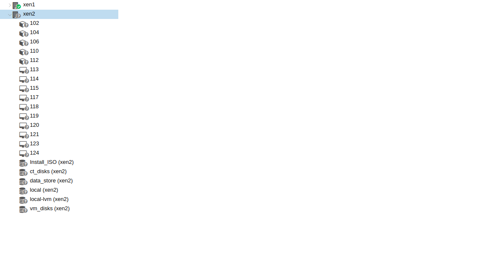

# Proxmox

## Vm nodes has gray question mark



```
systemctl status -l pvestatd
systemctl restart pvestatd
```

## Backup verify
```
unzstd /mnt/pve/backup/dump/vzdump-qemu-105-2020_08_18-21_48_56.vma.zst
vma verify /mnt/pve/backup/dump/vzdump-qemu-105-2020_08_18-21_48_56.vma -v
```